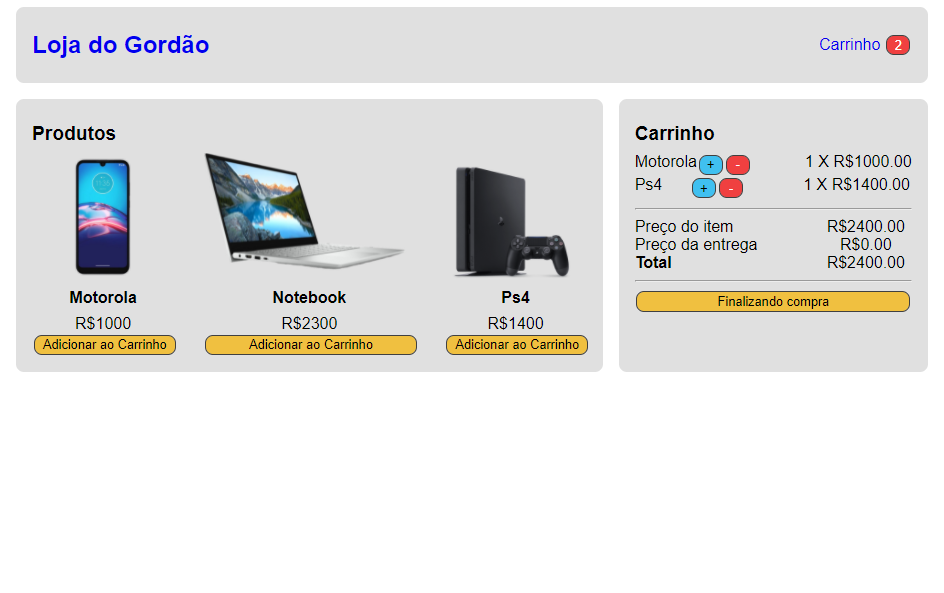
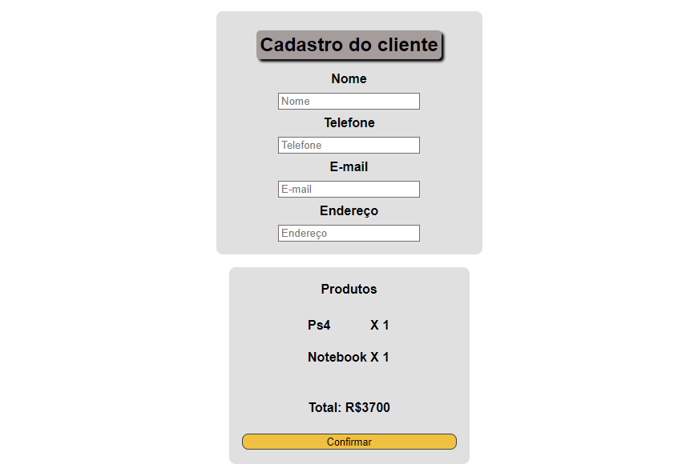

# Shopping Cart

# What this make?

This app is a simple shopping cart i didn't focused in style just if would work and it's working.

First- This app get the products and add on your shopping cart , after calculate all the values like shipping.
To check the app just follow the [link](https://my-shopping-carts.netlify.app)

# Dependencies

 To start this application fist you need to have Node.js [link](https://nodejs.org/en/)

```bash
  # Clone this repository
  $ git clone https://github.com/AugustoBernardes/Shopping-Cart

  # Install the dependency
  npm install react-router-dom
```


# Data

The shipping value is calculate with your total , if the total is more than 2000 the shipping is 0 if not is 50 bucks after you finish your shoppings you will be redirected to other page with all your products, quantitys and value to finish all the process. Before you finish your shopping you will be redirected to a final part that get the user data before finish the process and save on localstorage.

# Preview 🖥️




